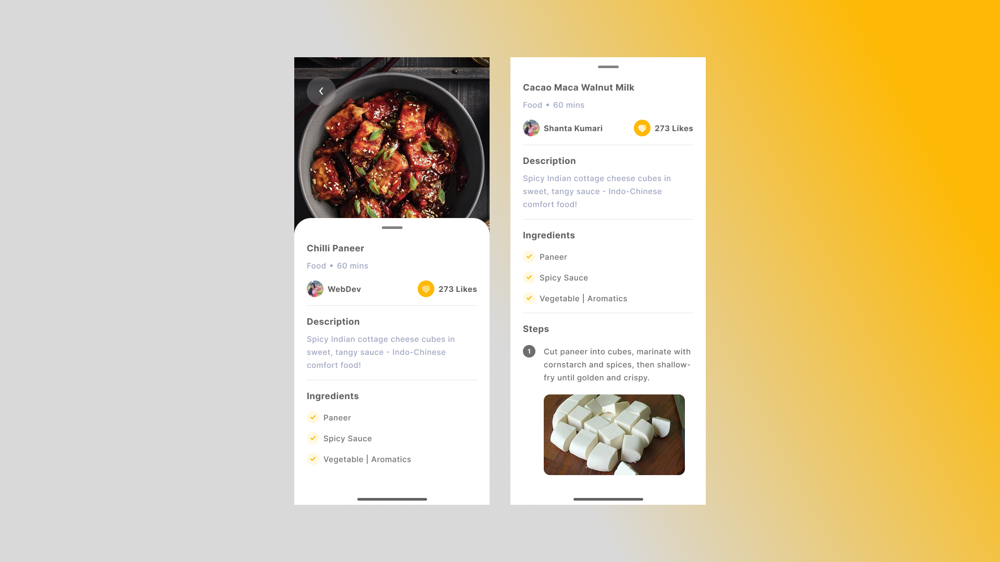

# Recipe App UI Challenge

## Overview
This project was created as part of a **frontend UI recreation challenge**. The goal was to **recreate a given mobile Recipe App UI design as closely as possible using only simple HTML and CSS** — no frameworks, no JavaScript, and no external libraries.

---

## Challenge Details

- **Objective**: Pixel-perfect (or as close as possible) replication of the provided UI mockup.
- **Tech Stack**: Pure **HTML5** and **CSS3**

---

## Design Reference
The target design was provided in the following screenshot:

---

## My Result
You can view the live version here:  
[**https://sms165.github.io/frontend-challenges-recipe_app_ui/**](https://sms165.github.io/frontend-challenges-recipe_app_ui/)

---
